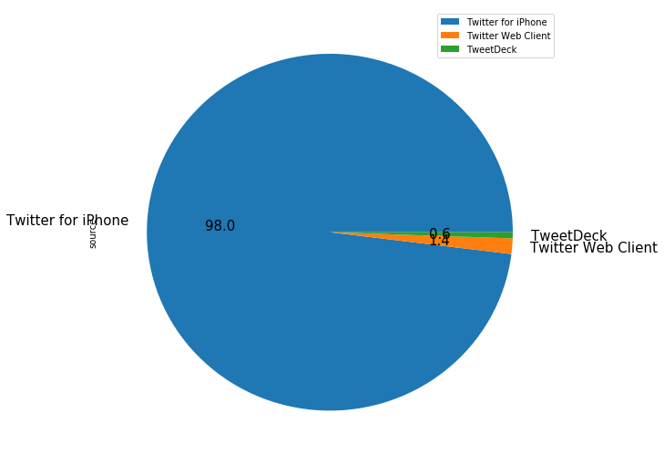

# WeRateDogs Tweet Analysis

## Table of Contents
<ul>
<li><a href="#intro">Introduction</a></li>
<li><a href="#gather">Gather</a></li>
<li><a href="#assess">Assess</a></li>
<li><a href="#clean">Clean</a></li>
<li><a href="#analyse">Analyse</a></li>
</ul>

<a id='intro'></a>
## Introduction
The Twitter account <a href="https://twitter.com/dog_rates?ref_src=twsrc%5Egoogle%7Ctwcamp%5Eserp%7Ctwgr%5Eauthor">WeRateDogs</a> has an international reputation and over six million followers. Its tweets consist of a picture of person's dog, an accompanying humorous comment, and a rating (always with a denominator of 10, but often containing numerators like 12, 13, or larger).

Graciously, @dog_rates has provided an archive of their tweets and we engage in a process of data gathering, wrangling and producing visualisations to derive insights about this famous Twitter account and the nature of their tweets.

<a id='gather'></a>
## Gather Data


```python
# import libraries
import pandas as pd
from bs4 import BeautifulSoup as bsp
import requests, tweepy, os, json
```


```python
# load weRateDogs Twitter archive into dataframe
archive = pd.read_csv('twitter-archive-enhanced.csv')
```


```python
# download the image predictions file
url = 'https://d17h27t6h515a5.cloudfront.net/topher/2017/August/599fd2ad_image-predictions/image-predictions.tsv'
response = requests.get(url)

with open(os.path.join(os.getcwd(), url.split('/')[-1]), mode='wb') as file:
    file.write(response.content)

# load breed predictions into dataframe
predictions = pd.read_csv(url.split('/')[-1], sep='\t')
```


```python
# create API object for gathering Twitter data
consumer_key = 'placeholder'
consumer_secret = 'placeholder'
access_token = 'placeholder'
access_secret = 'placeholder'

auth = tweepy.OAuthHandler(consumer_key, consumer_secret)
auth.set_access_token(access_token, access_secret)

api = tweepy.API(auth, wait_on_rate_limit=True)
```


```python
# query Twitter API and store JSON in text file
tweets = list(archive.tweet_id)
data = []

for tweet in tweets:
    try:
        info = api.get_status(tweet)
        data.append(info._json)
    except:
        print('Nothing found for ID: {}'.format(tweet))

with open(os.path.join(os.getcwd(), 'tweet_json.txt'), mode = 'w') as file:
    json.dump(data, file)
```

    Nothing found for ID: 888202515573088257
    Nothing found for ID: 873697596434513921
    Nothing found for ID: 869988702071779329
    Nothing found for ID: 861769973181624320
    Nothing found for ID: 842892208864923648
    Nothing found for ID: 802247111496568832
    Nothing found for ID: 775096608509886464
    Nothing found for ID: 771004394259247104
    Nothing found for ID: 758740312047005698
    Nothing found for ID: 676957860086095872


```python
# read text file into dataframe with Tweet ID, retweets and favourite count
data = []

with open(os.path.join(os.getcwd(), 'tweet_json.txt')) as file:
    tweets = json.load(file)
    for tweet in tweets:
        data.append({
            'tweet_id': tweet['id'],
            'retweets': tweet['retweet_count'],
            'favourites': tweet['favorite_count']
        })

interactions = pd.DataFrame(data, columns=['tweet_id', 'retweets', 'favourites'])
```

<a id="assess"></a>
## Assess Data

We have gathered our data from three different sources and loaded them into three different dataframes: `archive` contains the data from the Twitter archive file that was given to us, `predictions` contains the breed predictions from images run through the neural network, and `interactions` contains the per tweet favourite and retweet counts retrieved via the Twitter API. 

Now we are going to assess each dataframe visually and programmatically, defining the issues for cleaning. 

### archive


```python
archive
```


<div>
<style>
    .dataframe thead tr:only-child th {
        text-align: right;
    }

    .dataframe thead th {
        text-align: left;
    }

    .dataframe tbody tr th {
        vertical-align: top;
    }
</style>
<table border="1" class="dataframe">
  <thead>
    <tr style="text-align: right;">
      <th></th>
      <th>tweet_id</th>
      <th>in_reply_to_status_id</th>
      <th>in_reply_to_user_id</th>
      <th>timestamp</th>
      <th>source</th>
      <th>text</th>
      <th>retweeted_status_id</th>
      <th>retweeted_status_user_id</th>
      <th>retweeted_status_timestamp</th>
      <th>expanded_urls</th>
      <th>rating_numerator</th>
      <th>rating_denominator</th>
      <th>name</th>
      <th>doggo</th>
      <th>floofer</th>
      <th>pupper</th>
      <th>puppo</th>
    </tr>
  </thead>
  <tbody>
    <tr>
      <th>0</th>
      <td>892420643555336193</td>
      <td>NaN</td>
      <td>NaN</td>
      <td>2017-08-01 16:23:56 +0000</td>
      <td>&lt;a href="http://twitter.com/download/iphone" r...</td>
      <td>This is Phineas. He's a mystical boy. Only eve...</td>
      <td>NaN</td>
      <td>NaN</td>
      <td>NaN</td>
      <td>https://twitter.com/dog_rates/status/892420643...</td>
      <td>13</td>
      <td>10</td>
      <td>Phineas</td>
      <td>None</td>
      <td>None</td>
      <td>None</td>
      <td>None</td>
    </tr>
    <tr>
      <th>1</th>
      <td>892177421306343426</td>
      <td>NaN</td>
      <td>NaN</td>
      <td>2017-08-01 00:17:27 +0000</td>
      <td>&lt;a href="http://twitter.com/download/iphone" r...</td>
      <td>This is Tilly. She's just checking pup on you....</td>
      <td>NaN</td>
      <td>NaN</td>
      <td>NaN</td>
      <td>https://twitter.com/dog_rates/status/892177421...</td>
      <td>13</td>
      <td>10</td>
      <td>Tilly</td>
      <td>None</td>
      <td>None</td>
      <td>None</td>
      <td>None</td>
    </tr>
    <tr>
      <th>2</th>
      <td>891815181378084864</td>
      <td>NaN</td>
      <td>NaN</td>
      <td>2017-07-31 00:18:03 +0000</td>
      <td>&lt;a href="http://twitter.com/download/iphone" r...</td>
      <td>This is Archie. He is a rare Norwegian Pouncin...</td>
      <td>NaN</td>
      <td>NaN</td>
      <td>NaN</td>
      <td>https://twitter.com/dog_rates/status/891815181...</td>
      <td>12</td>
      <td>10</td>
      <td>Archie</td>
      <td>None</td>
      <td>None</td>
      <td>None</td>
      <td>None</td>
    </tr>
    <tr>
      <th>3</th>
      <td>891689557279858688</td>
      <td>NaN</td>
      <td>NaN</td>
      <td>2017-07-30 15:58:51 +0000</td>
      <td>&lt;a href="http://twitter.com/download/iphone" r...</td>
      <td>This is Darla. She commenced a snooze mid meal...</td>
      <td>NaN</td>
      <td>NaN</td>
      <td>NaN</td>
      <td>https://twitter.com/dog_rates/status/891689557...</td>
      <td>13</td>
      <td>10</td>
      <td>Darla</td>
      <td>None</td>
      <td>None</td>
      <td>None</td>
      <td>None</td>
    </tr>
    <tr>
      <th>4</th>
      <td>891327558926688256</td>
      <td>NaN</td>
      <td>NaN</td>
      <td>2017-07-29 16:00:24 +0000</td>
      <td>&lt;a href="http://twitter.com/download/iphone" r...</td>
      <td>This is Franklin. He would like you to stop ca...</td>
      <td>NaN</td>
      <td>NaN</td>
      <td>NaN</td>
      <td>https://twitter.com/dog_rates/status/891327558...</td>
      <td>12</td>
      <td>10</td>
      <td>Franklin</td>
      <td>None</td>
      <td>None</td>
      <td>None</td>
      <td>None</td>
    </tr>
    <tr>
      <th>5</th>
      <td>891087950875897856</td>
      <td>NaN</td>
      <td>NaN</td>
      <td>2017-07-29 00:08:17 +0000</td>
      <td>&lt;a href="http://twitter.com/download/iphone" r...</td>
      <td>Here we have a majestic great white breaching ...</td>
      <td>NaN</td>
      <td>NaN</td>
      <td>NaN</td>
      <td>https://twitter.com/dog_rates/status/891087950...</td>
      <td>13</td>
      <td>10</td>
      <td>None</td>
      <td>None</td>
      <td>None</td>
      <td>None</td>
      <td>None</td>
    </tr>
    <tr>
      <th>6</th>
      <td>890971913173991426</td>
      <td>NaN</td>
      <td>NaN</td>
      <td>2017-07-28 16:27:12 +0000</td>
      <td>&lt;a href="http://twitter.com/download/iphone" r...</td>
      <td>Meet Jax. He enjoys ice cream so much he gets ...</td>
      <td>NaN</td>
      <td>NaN</td>
      <td>NaN</td>
      <td>https://gofundme.com/ydvmve-surgery-for-jax,ht...</td>
      <td>13</td>
      <td>10</td>
      <td>Jax</td>
      <td>None</td>
      <td>None</td>
      <td>None</td>
      <td>None</td>
    </tr>
    <tr>
      <th>7</th>
      <td>890729181411237888</td>
      <td>NaN</td>
      <td>NaN</td>
      <td>2017-07-28 00:22:40 +0000</td>
      <td>&lt;a href="http://twitter.com/download/iphone" r...</td>
      <td>When you watch your owner call another dog a g...</td>
      <td>NaN</td>
      <td>NaN</td>
      <td>NaN</td>
      <td>https://twitter.com/dog_rates/status/890729181...</td>
      <td>13</td>
      <td>10</td>
      <td>None</td>
      <td>None</td>
      <td>None</td>
      <td>None</td>
      <td>None</td>
    </tr>
    <tr>
      <th>8</th>
      <td>890609185150312448</td>
      <td>NaN</td>
      <td>NaN</td>
      <td>2017-07-27 16:25:51 +0000</td>
      <td>&lt;a href="http://twitter.com/download/iphone" r...</td>
      <td>This is Zoey. She doesn't want to be one of th...</td>
      <td>NaN</td>
      <td>NaN</td>
      <td>NaN</td>
      <td>https://twitter.com/dog_rates/status/890609185...</td>
      <td>13</td>
      <td>10</td>
      <td>Zoey</td>
      <td>None</td>
      <td>None</td>
      <td>None</td>
      <td>None</td>
    </tr>
    <tr>
      <th>9</th>
      <td>890240255349198849</td>
      <td>NaN</td>
      <td>NaN</td>
      <td>2017-07-26 15:59:51 +0000</td>
      <td>&lt;a href="http://twitter.com/download/iphone" r...</td>
      <td>This is Cassie. She is a college pup. Studying...</td>
      <td>NaN</td>
      <td>NaN</td>
      <td>NaN</td>
      <td>https://twitter.com/dog_rates/status/890240255...</td>
      <td>14</td>
      <td>10</td>
      <td>Cassie</td>
      <td>doggo</td>
      <td>None</td>
      <td>None</td>
      <td>None</td>
    </tr>
    <tr>
      <th>10</th>
      <td>890006608113172480</td>
      <td>NaN</td>
      <td>NaN</td>
      <td>2017-07-26 00:31:25 +0000</td>
      <td>&lt;a href="http://twitter.com/download/iphone" r...</td>
      <td>This is Koda. He is a South Australian decksha...</td>
      <td>NaN</td>
      <td>NaN</td>
      <td>NaN</td>
      <td>https://twitter.com/dog_rates/status/890006608...</td>
      <td>13</td>
      <td>10</td>
      <td>Koda</td>
      <td>None</td>
      <td>None</td>
      <td>None</td>
      <td>None</td>
    </tr>
    <tr>
      <th>11</th>
      <td>889880896479866881</td>
      <td>NaN</td>
      <td>NaN</td>
      <td>2017-07-25 16:11:53 +0000</td>
      <td>&lt;a href="http://twitter.com/download/iphone" r...</td>
      <td>This is Bruno. He is a service shark. Only get...</td>
      <td>NaN</td>
      <td>NaN</td>
      <td>NaN</td>
      <td>https://twitter.com/dog_rates/status/889880896...</td>
      <td>13</td>
      <td>10</td>
      <td>Bruno</td>
      <td>None</td>
      <td>None</td>
      <td>None</td>
      <td>None</td>
    </tr>
    <tr>
      <th>12</th>
      <td>889665388333682689</td>
      <td>NaN</td>
      <td>NaN</td>
      <td>2017-07-25 01:55:32 +0000</td>
      <td>&lt;a href="http://twitter.com/download/iphone" r...</td>
      <td>Here's a puppo that seems to be on the fence a...</td>
      <td>NaN</td>
      <td>NaN</td>
      <td>NaN</td>
      <td>https://twitter.com/dog_rates/status/889665388...</td>
      <td>13</td>
      <td>10</td>
      <td>None</td>
      <td>None</td>
      <td>None</td>
      <td>None</td>
      <td>puppo</td>
    </tr>
    <tr>
      <th>13</th>
      <td>889638837579907072</td>
      <td>NaN</td>
      <td>NaN</td>
      <td>2017-07-25 00:10:02 +0000</td>
      <td>&lt;a href="http://twitter.com/download/iphone" r...</td>
      <td>This is Ted. He does his best. Sometimes that'...</td>
      <td>NaN</td>
      <td>NaN</td>
      <td>NaN</td>
      <td>https://twitter.com/dog_rates/status/889638837...</td>
      <td>12</td>
      <td>10</td>
      <td>Ted</td>
      <td>None</td>
      <td>None</td>
      <td>None</td>
      <td>None</td>
    </tr>
    <tr>
      <th>14</th>
      <td>889531135344209921</td>
      <td>NaN</td>
      <td>NaN</td>
      <td>2017-07-24 17:02:04 +0000</td>
      <td>&lt;a href="http://twitter.com/download/iphone" r...</td>
      <td>This is Stuart. He's sporting his favorite fan...</td>
      <td>NaN</td>
      <td>NaN</td>
      <td>NaN</td>
      <td>https://twitter.com/dog_rates/status/889531135...</td>
      <td>13</td>
      <td>10</td>
      <td>Stuart</td>
      <td>None</td>
      <td>None</td>
      <td>None</td>
      <td>puppo</td>
    </tr>
    <tr>
      <th>15</th>
      <td>889278841981685760</td>
      <td>NaN</td>
      <td>NaN</td>
      <td>2017-07-24 00:19:32 +0000</td>
      <td>&lt;a href="http://twitter.com/download/iphone" r...</td>
      <td>This is Oliver. You're witnessing one of his m...</td>
      <td>NaN</td>
      <td>NaN</td>
      <td>NaN</td>
      <td>https://twitter.com/dog_rates/status/889278841...</td>
      <td>13</td>
      <td>10</td>
      <td>Oliver</td>
      <td>None</td>
      <td>None</td>
      <td>None</td>
      <td>None</td>
    </tr>
    <tr>
      <th>16</th>
      <td>888917238123831296</td>
      <td>NaN</td>
      <td>NaN</td>
      <td>2017-07-23 00:22:39 +0000</td>
      <td>&lt;a href="http://twitter.com/download/iphone" r...</td>
      <td>This is Jim. He found a fren. Taught him how t...</td>
      <td>NaN</td>
      <td>NaN</td>
      <td>NaN</td>
      <td>https://twitter.com/dog_rates/status/888917238...</td>
      <td>12</td>
      <td>10</td>
      <td>Jim</td>
      <td>None</td>
      <td>None</td>
      <td>None</td>
      <td>None</td>
    </tr>
    <tr>
      <th>17</th>
      <td>888804989199671297</td>
      <td>NaN</td>
      <td>NaN</td>
      <td>2017-07-22 16:56:37 +0000</td>
      <td>&lt;a href="http://twitter.com/download/iphone" r...</td>
      <td>This is Zeke. He has a new stick. Very proud o...</td>
      <td>NaN</td>
      <td>NaN</td>
      <td>NaN</td>
      <td>https://twitter.com/dog_rates/status/888804989...</td>
      <td>13</td>
      <td>10</td>
      <td>Zeke</td>
      <td>None</td>
      <td>None</td>
      <td>None</td>
      <td>None</td>
    </tr>
    <tr>
      <th>18</th>
      <td>888554962724278272</td>
      <td>NaN</td>
      <td>NaN</td>
      <td>2017-07-22 00:23:06 +0000</td>
      <td>&lt;a href="http://twitter.com/download/iphone" r...</td>
      <td>This is Ralphus. He's powering up. Attempting ...</td>
      <td>NaN</td>
      <td>NaN</td>
      <td>NaN</td>
      <td>https://twitter.com/dog_rates/status/888554962...</td>
      <td>13</td>
      <td>10</td>
      <td>Ralphus</td>
      <td>None</td>
      <td>None</td>
      <td>None</td>
      <td>None</td>
    </tr>
    <tr>
      <th>19</th>
      <td>888202515573088257</td>
      <td>NaN</td>
      <td>NaN</td>
      <td>2017-07-21 01:02:36 +0000</td>
      <td>&lt;a href="http://twitter.com/download/iphone" r...</td>
      <td>RT @dog_rates: This is Canela. She attempted s...</td>
      <td>8.874740e+17</td>
      <td>4.196984e+09</td>
      <td>2017-07-19 00:47:34 +0000</td>
      <td>https://twitter.com/dog_rates/status/887473957...</td>
      <td>13</td>
      <td>10</td>
      <td>Canela</td>
      <td>None</td>
      <td>None</td>
      <td>None</td>
      <td>None</td>
    </tr>
    <tr>
      <th>20</th>
      <td>888078434458587136</td>
      <td>NaN</td>
      <td>NaN</td>
      <td>2017-07-20 16:49:33 +0000</td>
      <td>&lt;a href="http://twitter.com/download/iphone" r...</td>
      <td>This is Gerald. He was just told he didn't get...</td>
      <td>NaN</td>
      <td>NaN</td>
      <td>NaN</td>
      <td>https://twitter.com/dog_rates/status/888078434...</td>
      <td>12</td>
      <td>10</td>
      <td>Gerald</td>
      <td>None</td>
      <td>None</td>
      <td>None</td>
      <td>None</td>
    </tr>
    <tr>
      <th>21</th>
      <td>887705289381826560</td>
      <td>NaN</td>
      <td>NaN</td>
      <td>2017-07-19 16:06:48 +0000</td>
      <td>&lt;a href="http://twitter.com/download/iphone" r...</td>
      <td>This is Jeffrey. He has a monopoly on the pool...</td>
      <td>NaN</td>
      <td>NaN</td>
      <td>NaN</td>
      <td>https://twitter.com/dog_rates/status/887705289...</td>
      <td>13</td>
      <td>10</td>
      <td>Jeffrey</td>
      <td>None</td>
      <td>None</td>
      <td>None</td>
      <td>None</td>
    </tr>
    <tr>
      <th>22</th>
      <td>887517139158093824</td>
      <td>NaN</td>
      <td>NaN</td>
      <td>2017-07-19 03:39:09 +0000</td>
      <td>&lt;a href="http://twitter.com/download/iphone" r...</td>
      <td>I've yet to rate a Venezuelan Hover Wiener. Th...</td>
      <td>NaN</td>
      <td>NaN</td>
      <td>NaN</td>
      <td>https://twitter.com/dog_rates/status/887517139...</td>
      <td>14</td>
      <td>10</td>
      <td>such</td>
      <td>None</td>
      <td>None</td>
      <td>None</td>
      <td>None</td>
    </tr>
    <tr>
      <th>23</th>
      <td>887473957103951883</td>
      <td>NaN</td>
      <td>NaN</td>
      <td>2017-07-19 00:47:34 +0000</td>
      <td>&lt;a href="http://twitter.com/download/iphone" r...</td>
      <td>This is Canela. She attempted some fancy porch...</td>
      <td>NaN</td>
      <td>NaN</td>
      <td>NaN</td>
      <td>https://twitter.com/dog_rates/status/887473957...</td>
      <td>13</td>
      <td>10</td>
      <td>Canela</td>
      <td>None</td>
      <td>None</td>
      <td>None</td>
      <td>None</td>
    </tr>
    <tr>
      <th>24</th>
      <td>887343217045368832</td>
      <td>NaN</td>
      <td>NaN</td>
      <td>2017-07-18 16:08:03 +0000</td>
      <td>&lt;a href="http://twitter.com/download/iphone" r...</td>
      <td>You may not have known you needed to see this ...</td>
      <td>NaN</td>
      <td>NaN</td>
      <td>NaN</td>
      <td>https://twitter.com/dog_rates/status/887343217...</td>
      <td>13</td>
      <td>10</td>
      <td>None</td>
      <td>None</td>
      <td>None</td>
      <td>None</td>
      <td>None</td>
    </tr>
    <tr>
      <th>25</th>
      <td>887101392804085760</td>
      <td>NaN</td>
      <td>NaN</td>
      <td>2017-07-18 00:07:08 +0000</td>
      <td>&lt;a href="http://twitter.com/download/iphone" r...</td>
      <td>This... is a Jubilant Antarctic House Bear. We...</td>
      <td>NaN</td>
      <td>NaN</td>
      <td>NaN</td>
      <td>https://twitter.com/dog_rates/status/887101392...</td>
      <td>12</td>
      <td>10</td>
      <td>None</td>
      <td>None</td>
      <td>None</td>
      <td>None</td>
      <td>None</td>
    </tr>
    <tr>
      <th>26</th>
      <td>886983233522544640</td>
      <td>NaN</td>
      <td>NaN</td>
      <td>2017-07-17 16:17:36 +0000</td>
      <td>&lt;a href="http://twitter.com/download/iphone" r...</td>
      <td>This is Maya. She's very shy. Rarely leaves he...</td>
      <td>NaN</td>
      <td>NaN</td>
      <td>NaN</td>
      <td>https://twitter.com/dog_rates/status/886983233...</td>
      <td>13</td>
      <td>10</td>
      <td>Maya</td>
      <td>None</td>
      <td>None</td>
      <td>None</td>
      <td>None</td>
    </tr>
    <tr>
      <th>27</th>
      <td>886736880519319552</td>
      <td>NaN</td>
      <td>NaN</td>
      <td>2017-07-16 23:58:41 +0000</td>
      <td>&lt;a href="http://twitter.com/download/iphone" r...</td>
      <td>This is Mingus. He's a wonderful father to his...</td>
      <td>NaN</td>
      <td>NaN</td>
      <td>NaN</td>
      <td>https://www.gofundme.com/mingusneedsus,https:/...</td>
      <td>13</td>
      <td>10</td>
      <td>Mingus</td>
      <td>None</td>
      <td>None</td>
      <td>None</td>
      <td>None</td>
    </tr>
    <tr>
      <th>28</th>
      <td>886680336477933568</td>
      <td>NaN</td>
      <td>NaN</td>
      <td>2017-07-16 20:14:00 +0000</td>
      <td>&lt;a href="http://twitter.com/download/iphone" r...</td>
      <td>This is Derek. He's late for a dog meeting. 13...</td>
      <td>NaN</td>
      <td>NaN</td>
      <td>NaN</td>
      <td>https://twitter.com/dog_rates/status/886680336...</td>
      <td>13</td>
      <td>10</td>
      <td>Derek</td>
      <td>None</td>
      <td>None</td>
      <td>None</td>
      <td>None</td>
    </tr>
    <tr>
      <th>29</th>
      <td>886366144734445568</td>
      <td>NaN</td>
      <td>NaN</td>
      <td>2017-07-15 23:25:31 +0000</td>
      <td>&lt;a href="http://twitter.com/download/iphone" r...</td>
      <td>This is Roscoe. Another pupper fallen victim t...</td>
      <td>NaN</td>
      <td>NaN</td>
      <td>NaN</td>
      <td>https://twitter.com/dog_rates/status/886366144...</td>
      <td>12</td>
      <td>10</td>
      <td>Roscoe</td>
      <td>None</td>
      <td>None</td>
      <td>pupper</td>
      <td>None</td>
    </tr>
    <tr>
      <th>...</th>
      <td>...</td>
      <td>...</td>
      <td>...</td>
      <td>...</td>
      <td>...</td>
      <td>...</td>
      <td>...</td>
      <td>...</td>
      <td>...</td>
      <td>...</td>
      <td>...</td>
      <td>...</td>
      <td>...</td>
      <td>...</td>
      <td>...</td>
      <td>...</td>
      <td>...</td>
    </tr>
    <tr>
      <th>2326</th>
      <td>666411507551481857</td>
      <td>NaN</td>
      <td>NaN</td>
      <td>2015-11-17 00:24:19 +0000</td>
      <td>&lt;a href="http://twitter.com/download/iphone" r...</td>
      <td>This is quite the dog. Gets really excited whe...</td>
      <td>NaN</td>
      <td>NaN</td>
      <td>NaN</td>
      <td>https://twitter.com/dog_rates/status/666411507...</td>
      <td>2</td>
      <td>10</td>
      <td>quite</td>
      <td>None</td>
      <td>None</td>
      <td>None</td>
      <td>None</td>
    </tr>
    <tr>
      <th>2327</th>
      <td>666407126856765440</td>
      <td>NaN</td>
      <td>NaN</td>
      <td>2015-11-17 00:06:54 +0000</td>
      <td>&lt;a href="http://twitter.com/download/iphone" r...</td>
      <td>This is a southern Vesuvius bumblegruff. Can d...</td>
      <td>NaN</td>
      <td>NaN</td>
      <td>NaN</td>
      <td>https://twitter.com/dog_rates/status/666407126...</td>
      <td>7</td>
      <td>10</td>
      <td>a</td>
      <td>None</td>
      <td>None</td>
      <td>None</td>
      <td>None</td>
    </tr>
    <tr>
      <th>2328</th>
      <td>666396247373291520</td>
      <td>NaN</td>
      <td>NaN</td>
      <td>2015-11-16 23:23:41 +0000</td>
      <td>&lt;a href="http://twitter.com/download/iphone" r...</td>
      <td>Oh goodness. A super rare northeast Qdoba kang...</td>
      <td>NaN</td>
      <td>NaN</td>
      <td>NaN</td>
      <td>https://twitter.com/dog_rates/status/666396247...</td>
      <td>9</td>
      <td>10</td>
      <td>None</td>
      <td>None</td>
      <td>None</td>
      <td>None</td>
      <td>None</td>
    </tr>
    <tr>
      <th>2329</th>
      <td>666373753744588802</td>
      <td>NaN</td>
      <td>NaN</td>
      <td>2015-11-16 21:54:18 +0000</td>
      <td>&lt;a href="http://twitter.com/download/iphone" r...</td>
      <td>Those are sunglasses and a jean jacket. 11/10 ...</td>
      <td>NaN</td>
      <td>NaN</td>
      <td>NaN</td>
      <td>https://twitter.com/dog_rates/status/666373753...</td>
      <td>11</td>
      <td>10</td>
      <td>None</td>
      <td>None</td>
      <td>None</td>
      <td>None</td>
      <td>None</td>
    </tr>
    <tr>
      <th>2330</th>
      <td>666362758909284353</td>
      <td>NaN</td>
      <td>NaN</td>
      <td>2015-11-16 21:10:36 +0000</td>
      <td>&lt;a href="http://twitter.com/download/iphone" r...</td>
      <td>Unique dog here. Very small. Lives in containe...</td>
      <td>NaN</td>
      <td>NaN</td>
      <td>NaN</td>
      <td>https://twitter.com/dog_rates/status/666362758...</td>
      <td>6</td>
      <td>10</td>
      <td>None</td>
      <td>None</td>
      <td>None</td>
      <td>None</td>
      <td>None</td>
    </tr>
    <tr>
      <th>2331</th>
      <td>666353288456101888</td>
      <td>NaN</td>
      <td>NaN</td>
      <td>2015-11-16 20:32:58 +0000</td>
      <td>&lt;a href="http://twitter.com/download/iphone" r...</td>
      <td>Here we have a mixed Asiago from the Galápagos...</td>
      <td>NaN</td>
      <td>NaN</td>
      <td>NaN</td>
      <td>https://twitter.com/dog_rates/status/666353288...</td>
      <td>8</td>
      <td>10</td>
      <td>None</td>
      <td>None</td>
      <td>None</td>
      <td>None</td>
      <td>None</td>
    </tr>
    <tr>
      <th>2332</th>
      <td>666345417576210432</td>
      <td>NaN</td>
      <td>NaN</td>
      <td>2015-11-16 20:01:42 +0000</td>
      <td>&lt;a href="http://twitter.com/download/iphone" r...</td>
      <td>Look at this jokester thinking seat belt laws ...</td>
      <td>NaN</td>
      <td>NaN</td>
      <td>NaN</td>
      <td>https://twitter.com/dog_rates/status/666345417...</td>
      <td>10</td>
      <td>10</td>
      <td>None</td>
      <td>None</td>
      <td>None</td>
      <td>None</td>
      <td>None</td>
    </tr>
    <tr>
      <th>2333</th>
      <td>666337882303524864</td>
      <td>NaN</td>
      <td>NaN</td>
      <td>2015-11-16 19:31:45 +0000</td>
      <td>&lt;a href="http://twitter.com/download/iphone" r...</td>
      <td>This is an extremely rare horned Parthenon. No...</td>
      <td>NaN</td>
      <td>NaN</td>
      <td>NaN</td>
      <td>https://twitter.com/dog_rates/status/666337882...</td>
      <td>9</td>
      <td>10</td>
      <td>an</td>
      <td>None</td>
      <td>None</td>
      <td>None</td>
      <td>None</td>
    </tr>
    <tr>
      <th>2334</th>
      <td>666293911632134144</td>
      <td>NaN</td>
      <td>NaN</td>
      <td>2015-11-16 16:37:02 +0000</td>
      <td>&lt;a href="http://twitter.com/download/iphone" r...</td>
      <td>This is a funny dog. Weird toes. Won't come do...</td>
      <td>NaN</td>
      <td>NaN</td>
      <td>NaN</td>
      <td>https://twitter.com/dog_rates/status/666293911...</td>
      <td>3</td>
      <td>10</td>
      <td>a</td>
      <td>None</td>
      <td>None</td>
      <td>None</td>
      <td>None</td>
    </tr>
    <tr>
      <th>2335</th>
      <td>666287406224695296</td>
      <td>NaN</td>
      <td>NaN</td>
      <td>2015-11-16 16:11:11 +0000</td>
      <td>&lt;a href="http://twitter.com/download/iphone" r...</td>
      <td>This is an Albanian 3 1/2 legged  Episcopalian...</td>
      <td>NaN</td>
      <td>NaN</td>
      <td>NaN</td>
      <td>https://twitter.com/dog_rates/status/666287406...</td>
      <td>1</td>
      <td>2</td>
      <td>an</td>
      <td>None</td>
      <td>None</td>
      <td>None</td>
      <td>None</td>
    </tr>
    <tr>
      <th>2336</th>
      <td>666273097616637952</td>
      <td>NaN</td>
      <td>NaN</td>
      <td>2015-11-16 15:14:19 +0000</td>
      <td>&lt;a href="http://twitter.com/download/iphone" r...</td>
      <td>Can take selfies 11/10 https://t.co/ws2AMaNwPW</td>
      <td>NaN</td>
      <td>NaN</td>
      <td>NaN</td>
      <td>https://twitter.com/dog_rates/status/666273097...</td>
      <td>11</td>
      <td>10</td>
      <td>None</td>
      <td>None</td>
      <td>None</td>
      <td>None</td>
      <td>None</td>
    </tr>
    <tr>
      <th>2337</th>
      <td>666268910803644416</td>
      <td>NaN</td>
      <td>NaN</td>
      <td>2015-11-16 14:57:41 +0000</td>
      <td>&lt;a href="http://twitter.com/download/iphone" r...</td>
      <td>Very concerned about fellow dog trapped in com...</td>
      <td>NaN</td>
      <td>NaN</td>
      <td>NaN</td>
      <td>https://twitter.com/dog_rates/status/666268910...</td>
      <td>10</td>
      <td>10</td>
      <td>None</td>
      <td>None</td>
      <td>None</td>
      <td>None</td>
      <td>None</td>
    </tr>
    <tr>
      <th>2338</th>
      <td>666104133288665088</td>
      <td>NaN</td>
      <td>NaN</td>
      <td>2015-11-16 04:02:55 +0000</td>
      <td>&lt;a href="http://twitter.com/download/iphone" r...</td>
      <td>Not familiar with this breed. No tail (weird)....</td>
      <td>NaN</td>
      <td>NaN</td>
      <td>NaN</td>
      <td>https://twitter.com/dog_rates/status/666104133...</td>
      <td>1</td>
      <td>10</td>
      <td>None</td>
      <td>None</td>
      <td>None</td>
      <td>None</td>
      <td>None</td>
    </tr>
    <tr>
      <th>2339</th>
      <td>666102155909144576</td>
      <td>NaN</td>
      <td>NaN</td>
      <td>2015-11-16 03:55:04 +0000</td>
      <td>&lt;a href="http://twitter.com/download/iphone" r...</td>
      <td>Oh my. Here you are seeing an Adobe Setter giv...</td>
      <td>NaN</td>
      <td>NaN</td>
      <td>NaN</td>
      <td>https://twitter.com/dog_rates/status/666102155...</td>
      <td>11</td>
      <td>10</td>
      <td>None</td>
      <td>None</td>
      <td>None</td>
      <td>None</td>
      <td>None</td>
    </tr>
    <tr>
      <th>2340</th>
      <td>666099513787052032</td>
      <td>NaN</td>
      <td>NaN</td>
      <td>2015-11-16 03:44:34 +0000</td>
      <td>&lt;a href="http://twitter.com/download/iphone" r...</td>
      <td>Can stand on stump for what seems like a while...</td>
      <td>NaN</td>
      <td>NaN</td>
      <td>NaN</td>
      <td>https://twitter.com/dog_rates/status/666099513...</td>
      <td>8</td>
      <td>10</td>
      <td>None</td>
      <td>None</td>
      <td>None</td>
      <td>None</td>
      <td>None</td>
    </tr>
    <tr>
      <th>2341</th>
      <td>666094000022159362</td>
      <td>NaN</td>
      <td>NaN</td>
      <td>2015-11-16 03:22:39 +0000</td>
      <td>&lt;a href="http://twitter.com/download/iphone" r...</td>
      <td>This appears to be a Mongolian Presbyterian mi...</td>
      <td>NaN</td>
      <td>NaN</td>
      <td>NaN</td>
      <td>https://twitter.com/dog_rates/status/666094000...</td>
      <td>9</td>
      <td>10</td>
      <td>None</td>
      <td>None</td>
      <td>None</td>
      <td>None</td>
      <td>None</td>
    </tr>
    <tr>
      <th>2342</th>
      <td>666082916733198337</td>
      <td>NaN</td>
      <td>NaN</td>
      <td>2015-11-16 02:38:37 +0000</td>
      <td>&lt;a href="http://twitter.com/download/iphone" r...</td>
      <td>Here we have a well-established sunblockerspan...</td>
      <td>NaN</td>
      <td>NaN</td>
      <td>NaN</td>
      <td>https://twitter.com/dog_rates/status/666082916...</td>
      <td>6</td>
      <td>10</td>
      <td>None</td>
      <td>None</td>
      <td>None</td>
      <td>None</td>
      <td>None</td>
    </tr>
    <tr>
      <th>2343</th>
      <td>666073100786774016</td>
      <td>NaN</td>
      <td>NaN</td>
      <td>2015-11-16 01:59:36 +0000</td>
      <td>&lt;a href="http://twitter.com/download/iphone" r...</td>
      <td>Let's hope this flight isn't Malaysian (lol). ...</td>
      <td>NaN</td>
      <td>NaN</td>
      <td>NaN</td>
      <td>https://twitter.com/dog_rates/status/666073100...</td>
      <td>10</td>
      <td>10</td>
      <td>None</td>
      <td>None</td>
      <td>None</td>
      <td>None</td>
      <td>None</td>
    </tr>
    <tr>
      <th>2344</th>
      <td>666071193221509120</td>
      <td>NaN</td>
      <td>NaN</td>
      <td>2015-11-16 01:52:02 +0000</td>
      <td>&lt;a href="http://twitter.com/download/iphone" r...</td>
      <td>Here we have a northern speckled Rhododendron....</td>
      <td>NaN</td>
      <td>NaN</td>
      <td>NaN</td>
      <td>https://twitter.com/dog_rates/status/666071193...</td>
      <td>9</td>
      <td>10</td>
      <td>None</td>
      <td>None</td>
      <td>None</td>
      <td>None</td>
      <td>None</td>
    </tr>
    <tr>
      <th>2345</th>
      <td>666063827256086533</td>
      <td>NaN</td>
      <td>NaN</td>
      <td>2015-11-16 01:22:45 +0000</td>
      <td>&lt;a href="http://twitter.com/download/iphone" r...</td>
      <td>This is the happiest dog you will ever see. Ve...</td>
      <td>NaN</td>
      <td>NaN</td>
      <td>NaN</td>
      <td>https://twitter.com/dog_rates/status/666063827...</td>
      <td>10</td>
      <td>10</td>
      <td>the</td>
      <td>None</td>
      <td>None</td>
      <td>None</td>
      <td>None</td>
    </tr>
    <tr>
      <th>2346</th>
      <td>666058600524156928</td>
      <td>NaN</td>
      <td>NaN</td>
      <td>2015-11-16 01:01:59 +0000</td>
      <td>&lt;a href="http://twitter.com/download/iphone" r...</td>
      <td>Here is the Rand Paul of retrievers folks! He'...</td>
      <td>NaN</td>
      <td>NaN</td>
      <td>NaN</td>
      <td>https://twitter.com/dog_rates/status/666058600...</td>
      <td>8</td>
      <td>10</td>
      <td>the</td>
      <td>None</td>
      <td>None</td>
      <td>None</td>
      <td>None</td>
    </tr>
    <tr>
      <th>2347</th>
      <td>666057090499244032</td>
      <td>NaN</td>
      <td>NaN</td>
      <td>2015-11-16 00:55:59 +0000</td>
      <td>&lt;a href="http://twitter.com/download/iphone" r...</td>
      <td>My oh my. This is a rare blond Canadian terrie...</td>
      <td>NaN</td>
      <td>NaN</td>
      <td>NaN</td>
      <td>https://twitter.com/dog_rates/status/666057090...</td>
      <td>9</td>
      <td>10</td>
      <td>a</td>
      <td>None</td>
      <td>None</td>
      <td>None</td>
      <td>None</td>
    </tr>
    <tr>
      <th>2348</th>
      <td>666055525042405380</td>
      <td>NaN</td>
      <td>NaN</td>
      <td>2015-11-16 00:49:46 +0000</td>
      <td>&lt;a href="http://twitter.com/download/iphone" r...</td>
      <td>Here is a Siberian heavily armored polar bear ...</td>
      <td>NaN</td>
      <td>NaN</td>
      <td>NaN</td>
      <td>https://twitter.com/dog_rates/status/666055525...</td>
      <td>10</td>
      <td>10</td>
      <td>a</td>
      <td>None</td>
      <td>None</td>
      <td>None</td>
      <td>None</td>
    </tr>
    <tr>
      <th>2349</th>
      <td>666051853826850816</td>
      <td>NaN</td>
      <td>NaN</td>
      <td>2015-11-16 00:35:11 +0000</td>
      <td>&lt;a href="http://twitter.com/download/iphone" r...</td>
      <td>This is an odd dog. Hard on the outside but lo...</td>
      <td>NaN</td>
      <td>NaN</td>
      <td>NaN</td>
      <td>https://twitter.com/dog_rates/status/666051853...</td>
      <td>2</td>
      <td>10</td>
      <td>an</td>
      <td>None</td>
      <td>None</td>
      <td>None</td>
      <td>None</td>
    </tr>
    <tr>
      <th>2350</th>
      <td>666050758794694657</td>
      <td>NaN</td>
      <td>NaN</td>
      <td>2015-11-16 00:30:50 +0000</td>
      <td>&lt;a href="http://twitter.com/download/iphone" r...</td>
      <td>This is a truly beautiful English Wilson Staff...</td>
      <td>NaN</td>
      <td>NaN</td>
      <td>NaN</td>
      <td>https://twitter.com/dog_rates/status/666050758...</td>
      <td>10</td>
      <td>10</td>
      <td>a</td>
      <td>None</td>
      <td>None</td>
      <td>None</td>
      <td>None</td>
    </tr>
    <tr>
      <th>2351</th>
      <td>666049248165822465</td>
      <td>NaN</td>
      <td>NaN</td>
      <td>2015-11-16 00:24:50 +0000</td>
      <td>&lt;a href="http://twitter.com/download/iphone" r...</td>
      <td>Here we have a 1949 1st generation vulpix. Enj...</td>
      <td>NaN</td>
      <td>NaN</td>
      <td>NaN</td>
      <td>https://twitter.com/dog_rates/status/666049248...</td>
      <td>5</td>
      <td>10</td>
      <td>None</td>
      <td>None</td>
      <td>None</td>
      <td>None</td>
      <td>None</td>
    </tr>
    <tr>
      <th>2352</th>
      <td>666044226329800704</td>
      <td>NaN</td>
      <td>NaN</td>
      <td>2015-11-16 00:04:52 +0000</td>
      <td>&lt;a href="http://twitter.com/download/iphone" r...</td>
      <td>This is a purebred Piers Morgan. Loves to Netf...</td>
      <td>NaN</td>
      <td>NaN</td>
      <td>NaN</td>
      <td>https://twitter.com/dog_rates/status/666044226...</td>
      <td>6</td>
      <td>10</td>
      <td>a</td>
      <td>None</td>
      <td>None</td>
      <td>None</td>
      <td>None</td>
    </tr>
    <tr>
      <th>2353</th>
      <td>666033412701032449</td>
      <td>NaN</td>
      <td>NaN</td>
      <td>2015-11-15 23:21:54 +0000</td>
      <td>&lt;a href="http://twitter.com/download/iphone" r...</td>
      <td>Here is a very happy pup. Big fan of well-main...</td>
      <td>NaN</td>
      <td>NaN</td>
      <td>NaN</td>
      <td>https://twitter.com/dog_rates/status/666033412...</td>
      <td>9</td>
      <td>10</td>
      <td>a</td>
      <td>None</td>
      <td>None</td>
      <td>None</td>
      <td>None</td>
    </tr>
    <tr>
      <th>2354</th>
      <td>666029285002620928</td>
      <td>NaN</td>
      <td>NaN</td>
      <td>2015-11-15 23:05:30 +0000</td>
      <td>&lt;a href="http://twitter.com/download/iphone" r...</td>
      <td>This is a western brown Mitsubishi terrier. Up...</td>
      <td>NaN</td>
      <td>NaN</td>
      <td>NaN</td>
      <td>https://twitter.com/dog_rates/status/666029285...</td>
      <td>7</td>
      <td>10</td>
      <td>a</td>
      <td>None</td>
      <td>None</td>
      <td>None</td>
      <td>None</td>
    </tr>
    <tr>
      <th>2355</th>
      <td>666020888022790149</td>
      <td>NaN</td>
      <td>NaN</td>
      <td>2015-11-15 22:32:08 +0000</td>
      <td>&lt;a href="http://twitter.com/download/iphone" r...</td>
      <td>Here we have a Japanese Irish Setter. Lost eye...</td>
      <td>NaN</td>
      <td>NaN</td>
      <td>NaN</td>
      <td>https://twitter.com/dog_rates/status/666020888...</td>
      <td>8</td>
      <td>10</td>
      <td>None</td>
      <td>None</td>
      <td>None</td>
      <td>None</td>
      <td>None</td>
    </tr>
  </tbody>
</table>
<p>2356 rows × 17 columns</p>
</div>


One first glance at the dataframe reveals issues, for example the value for `source` is HTML rather than a string. Some columns such as `in_reply_to_status_id`, `in_reply_to_user_id`, `retweeted_status_id`, `retweeted_status_user_id`, `retweeted_status_timestamp` seem to be almost always empty. This is not a quality issue, but rather a reflection of the fact that most of these tweets are not replies nor retweets. Let's investigate futher using Pandas functions.


```python
archive.info()
```

    <class 'pandas.core.frame.DataFrame'>
    RangeIndex: 2356 entries, 0 to 2355
    Data columns (total 17 columns):
    tweet_id                      2356 non-null int64
    in_reply_to_status_id         78 non-null float64
    in_reply_to_user_id           78 non-null float64
    timestamp                     2356 non-null object
    source                        2356 non-null object
    text                          2356 non-null object
    retweeted_status_id           181 non-null float64
    retweeted_status_user_id      181 non-null float64
    retweeted_status_timestamp    181 non-null object
    expanded_urls                 2297 non-null object
    rating_numerator              2356 non-null int64
    rating_denominator            2356 non-null int64
    name                          2356 non-null object
    doggo                         2356 non-null object
    floofer                       2356 non-null object
    pupper                        2356 non-null object
    puppo                         2356 non-null object
    dtypes: float64(4), int64(3), object(10)
    memory usage: 313.0+ KB


```python
archive.source.value_counts()
```


    <a href="http://twitter.com/download/iphone" rel="nofollow">Twitter for iPhone</a>     2221
    <a href="http://vine.co" rel="nofollow">Vine - Make a Scene</a>                          91
    <a href="http://twitter.com" rel="nofollow">Twitter Web Client</a>                       33
    <a href="https://about.twitter.com/products/tweetdeck" rel="nofollow">TweetDeck</a>      11
    Name: source, dtype: int64


```python
archive.floofer.value_counts()
```


    None       2346
    floofer      10
    Name: floofer, dtype: int64


```python
archive.puppo.value_counts()
```


    None     2326
    puppo      30
    Name: puppo, dtype: int64


```python
sum(archive.tweet_id.duplicated())
```


    0


```python
archive.name.value_counts()
```


    None         745
    a             55
    Charlie       12
    Oliver        11
    Cooper        11
    Lucy          11
    Penny         10
    Tucker        10
    Lola          10
    Bo             9
    Winston        9
    Sadie          8
    the            8
    an             7
    Toby           7
    Daisy          7
    Bailey         7
    Buddy          7
    Oscar          6
    Dave           6
    Milo           6
    Bella          6
    Scout          6
    Rusty          6
    Koda           6
    Jax            6
    Leo            6
    Jack           6
    Stanley        6
    Phil           5
                ... 
    Dug            1
    Laika          1
    Maude          1
    Mac            1
    Florence       1
    Sonny          1
    Frönq          1
    Pancake        1
    Sundance       1
    Luther         1
    Lupe           1
    Rudy           1
    Jordy          1
    Andru          1
    Toffee         1
    Naphaniel      1
    Cal            1
    Dex            1
    Carter         1
    Danny          1
    Lulu           1
    Grizzwald      1
    Boots          1
    Tino           1
    Banjo          1
    Duddles        1
    Pawnd          1
    Grady          1
    Jazz           1
    Perry          1
    Name: name, Length: 957, dtype: int64


```python
archive[archive.rating_denominator < 10]
```


<div>
<style>
    .dataframe thead tr:only-child th {
        text-align: right;
    }

    .dataframe thead th {
        text-align: left;
    }

    .dataframe tbody tr th {
        vertical-align: top;
    }
</style>
<table border="1" class="dataframe">
  <thead>
    <tr style="text-align: right;">
      <th></th>
      <th>tweet_id</th>
      <th>in_reply_to_status_id</th>
      <th>in_reply_to_user_id</th>
      <th>timestamp</th>
      <th>source</th>
      <th>text</th>
      <th>retweeted_status_id</th>
      <th>retweeted_status_user_id</th>
      <th>retweeted_status_timestamp</th>
      <th>expanded_urls</th>
      <th>rating_numerator</th>
      <th>rating_denominator</th>
      <th>name</th>
      <th>doggo</th>
      <th>floofer</th>
      <th>pupper</th>
      <th>puppo</th>
    </tr>
  </thead>
  <tbody>
    <tr>
      <th>313</th>
      <td>835246439529840640</td>
      <td>8.352460e+17</td>
      <td>26259576.0</td>
      <td>2017-02-24 21:54:03 +0000</td>
      <td>&lt;a href="http://twitter.com/download/iphone" r...</td>
      <td>@jonnysun @Lin_Manuel ok jomny I know you're e...</td>
      <td>NaN</td>
      <td>NaN</td>
      <td>NaN</td>
      <td>NaN</td>
      <td>960</td>
      <td>0</td>
      <td>None</td>
      <td>None</td>
      <td>None</td>
      <td>None</td>
      <td>None</td>
    </tr>
    <tr>
      <th>516</th>
      <td>810984652412424192</td>
      <td>NaN</td>
      <td>NaN</td>
      <td>2016-12-19 23:06:23 +0000</td>
      <td>&lt;a href="http://twitter.com/download/iphone" r...</td>
      <td>Meet Sam. She smiles 24/7 &amp;amp; secretly aspir...</td>
      <td>NaN</td>
      <td>NaN</td>
      <td>NaN</td>
      <td>https://www.gofundme.com/sams-smile,https://tw...</td>
      <td>24</td>
      <td>7</td>
      <td>Sam</td>
      <td>None</td>
      <td>None</td>
      <td>None</td>
      <td>None</td>
    </tr>
    <tr>
      <th>2335</th>
      <td>666287406224695296</td>
      <td>NaN</td>
      <td>NaN</td>
      <td>2015-11-16 16:11:11 +0000</td>
      <td>&lt;a href="http://twitter.com/download/iphone" r...</td>
      <td>This is an Albanian 3 1/2 legged  Episcopalian...</td>
      <td>NaN</td>
      <td>NaN</td>
      <td>NaN</td>
      <td>https://twitter.com/dog_rates/status/666287406...</td>
      <td>1</td>
      <td>2</td>
      <td>an</td>
      <td>None</td>
      <td>None</td>
      <td>None</td>
      <td>None</td>
    </tr>
  </tbody>
</table>
</div>


```python
archive.iloc[313].text
```


    "@jonnysun @Lin_Manuel ok jomny I know you're excited but 960/00 isn't a valid rating, 13/10 is tho"


```python
archive.in_reply_to_user_id.value_counts()
```


    4.196984e+09    47
    2.195506e+07     2
    7.305050e+17     1
    2.916630e+07     1
    3.105441e+09     1
    2.918590e+08     1
    2.792810e+08     1
    2.319108e+09     1
    1.806710e+08     1
    3.058208e+07     1
    2.625958e+07     1
    1.943518e+08     1
    3.589728e+08     1
    8.405479e+17     1
    2.894131e+09     1
    2.143566e+07     1
    2.281182e+09     1
    1.648776e+07     1
    4.717297e+09     1
    2.878549e+07     1
    1.582854e+09     1
    4.670367e+08     1
    4.738443e+07     1
    1.361572e+07     1
    1.584641e+07     1
    2.068372e+07     1
    1.637468e+07     1
    1.185634e+07     1
    1.198989e+09     1
    1.132119e+08     1
    7.759620e+07     1
    Name: in_reply_to_user_id, dtype: int64


### predictions


```python
predictions.head(10)
```


<div>
<style>
    .dataframe thead tr:only-child th {
        text-align: right;
    }

    .dataframe thead th {
        text-align: left;
    }

    .dataframe tbody tr th {
        vertical-align: top;
    }
</style>
<table border="1" class="dataframe">
  <thead>
    <tr style="text-align: right;">
      <th></th>
      <th>tweet_id</th>
      <th>jpg_url</th>
      <th>img_num</th>
      <th>p1</th>
      <th>p1_conf</th>
      <th>p1_dog</th>
      <th>p2</th>
      <th>p2_conf</th>
      <th>p2_dog</th>
      <th>p3</th>
      <th>p3_conf</th>
      <th>p3_dog</th>
    </tr>
  </thead>
  <tbody>
    <tr>
      <th>0</th>
      <td>666020888022790149</td>
      <td>https://pbs.twimg.com/media/CT4udn0WwAA0aMy.jpg</td>
      <td>1</td>
      <td>Welsh_springer_spaniel</td>
      <td>0.465074</td>
      <td>True</td>
      <td>collie</td>
      <td>0.156665</td>
      <td>True</td>
      <td>Shetland_sheepdog</td>
      <td>0.061428</td>
      <td>True</td>
    </tr>
    <tr>
      <th>1</th>
      <td>666029285002620928</td>
      <td>https://pbs.twimg.com/media/CT42GRgUYAA5iDo.jpg</td>
      <td>1</td>
      <td>redbone</td>
      <td>0.506826</td>
      <td>True</td>
      <td>miniature_pinscher</td>
      <td>0.074192</td>
      <td>True</td>
      <td>Rhodesian_ridgeback</td>
      <td>0.072010</td>
      <td>True</td>
    </tr>
    <tr>
      <th>2</th>
      <td>666033412701032449</td>
      <td>https://pbs.twimg.com/media/CT4521TWwAEvMyu.jpg</td>
      <td>1</td>
      <td>German_shepherd</td>
      <td>0.596461</td>
      <td>True</td>
      <td>malinois</td>
      <td>0.138584</td>
      <td>True</td>
      <td>bloodhound</td>
      <td>0.116197</td>
      <td>True</td>
    </tr>
    <tr>
      <th>3</th>
      <td>666044226329800704</td>
      <td>https://pbs.twimg.com/media/CT5Dr8HUEAA-lEu.jpg</td>
      <td>1</td>
      <td>Rhodesian_ridgeback</td>
      <td>0.408143</td>
      <td>True</td>
      <td>redbone</td>
      <td>0.360687</td>
      <td>True</td>
      <td>miniature_pinscher</td>
      <td>0.222752</td>
      <td>True</td>
    </tr>
    <tr>
      <th>4</th>
      <td>666049248165822465</td>
      <td>https://pbs.twimg.com/media/CT5IQmsXIAAKY4A.jpg</td>
      <td>1</td>
      <td>miniature_pinscher</td>
      <td>0.560311</td>
      <td>True</td>
      <td>Rottweiler</td>
      <td>0.243682</td>
      <td>True</td>
      <td>Doberman</td>
      <td>0.154629</td>
      <td>True</td>
    </tr>
    <tr>
      <th>5</th>
      <td>666050758794694657</td>
      <td>https://pbs.twimg.com/media/CT5Jof1WUAEuVxN.jpg</td>
      <td>1</td>
      <td>Bernese_mountain_dog</td>
      <td>0.651137</td>
      <td>True</td>
      <td>English_springer</td>
      <td>0.263788</td>
      <td>True</td>
      <td>Greater_Swiss_Mountain_dog</td>
      <td>0.016199</td>
      <td>True</td>
    </tr>
    <tr>
      <th>6</th>
      <td>666051853826850816</td>
      <td>https://pbs.twimg.com/media/CT5KoJ1WoAAJash.jpg</td>
      <td>1</td>
      <td>box_turtle</td>
      <td>0.933012</td>
      <td>False</td>
      <td>mud_turtle</td>
      <td>0.045885</td>
      <td>False</td>
      <td>terrapin</td>
      <td>0.017885</td>
      <td>False</td>
    </tr>
    <tr>
      <th>7</th>
      <td>666055525042405380</td>
      <td>https://pbs.twimg.com/media/CT5N9tpXIAAifs1.jpg</td>
      <td>1</td>
      <td>chow</td>
      <td>0.692517</td>
      <td>True</td>
      <td>Tibetan_mastiff</td>
      <td>0.058279</td>
      <td>True</td>
      <td>fur_coat</td>
      <td>0.054449</td>
      <td>False</td>
    </tr>
    <tr>
      <th>8</th>
      <td>666057090499244032</td>
      <td>https://pbs.twimg.com/media/CT5PY90WoAAQGLo.jpg</td>
      <td>1</td>
      <td>shopping_cart</td>
      <td>0.962465</td>
      <td>False</td>
      <td>shopping_basket</td>
      <td>0.014594</td>
      <td>False</td>
      <td>golden_retriever</td>
      <td>0.007959</td>
      <td>True</td>
    </tr>
    <tr>
      <th>9</th>
      <td>666058600524156928</td>
      <td>https://pbs.twimg.com/media/CT5Qw94XAAA_2dP.jpg</td>
      <td>1</td>
      <td>miniature_poodle</td>
      <td>0.201493</td>
      <td>True</td>
      <td>komondor</td>
      <td>0.192305</td>
      <td>True</td>
      <td>soft-coated_wheaten_terrier</td>
      <td>0.082086</td>
      <td>True</td>
    </tr>
  </tbody>
</table>
</div>


A preliminary visual inspection does not reveal any particular problems with this dataset. One issue would be the inconsistent formatting of values for the `p1`, `p2`, `p3` columns. Let's engage in programmatic assessment to investigate further.


```python
predictions.info()
```

    <class 'pandas.core.frame.DataFrame'>
    RangeIndex: 2075 entries, 0 to 2074
    Data columns (total 12 columns):
    tweet_id    2075 non-null int64
    jpg_url     2075 non-null object
    img_num     2075 non-null int64
    p1          2075 non-null object
    p1_conf     2075 non-null float64
    p1_dog      2075 non-null bool
    p2          2075 non-null object
    p2_conf     2075 non-null float64
    p2_dog      2075 non-null bool
    p3          2075 non-null object
    p3_conf     2075 non-null float64
    p3_dog      2075 non-null bool
    dtypes: bool(3), float64(3), int64(2), object(4)
    memory usage: 152.1+ KB


No missing values, and correct datatypes: good. Let us see if there are any duplicate values


```python
sum(predictions.tweet_id.duplicated())
```


    0


### interactions


```python
interactions.head(10)
```


<div>
<style>
    .dataframe thead tr:only-child th {
        text-align: right;
    }

    .dataframe thead th {
        text-align: left;
    }

    .dataframe tbody tr th {
        vertical-align: top;
    }
</style>
<table border="1" class="dataframe">
  <thead>
    <tr style="text-align: right;">
      <th></th>
      <th>tweet_id</th>
      <th>retweets</th>
      <th>favourites</th>
    </tr>
  </thead>
  <tbody>
    <tr>
      <th>0</th>
      <td>892420643555336193</td>
      <td>8763</td>
      <td>39227</td>
    </tr>
    <tr>
      <th>1</th>
      <td>892177421306343426</td>
      <td>6422</td>
      <td>33600</td>
    </tr>
    <tr>
      <th>2</th>
      <td>891815181378084864</td>
      <td>4266</td>
      <td>25313</td>
    </tr>
    <tr>
      <th>3</th>
      <td>891689557279858688</td>
      <td>8849</td>
      <td>42607</td>
    </tr>
    <tr>
      <th>4</th>
      <td>891327558926688256</td>
      <td>9637</td>
      <td>40771</td>
    </tr>
    <tr>
      <th>5</th>
      <td>891087950875897856</td>
      <td>3209</td>
      <td>20441</td>
    </tr>
    <tr>
      <th>6</th>
      <td>890971913173991426</td>
      <td>2128</td>
      <td>11987</td>
    </tr>
    <tr>
      <th>7</th>
      <td>890729181411237888</td>
      <td>19368</td>
      <td>66304</td>
    </tr>
    <tr>
      <th>8</th>
      <td>890609185150312448</td>
      <td>4364</td>
      <td>28061</td>
    </tr>
    <tr>
      <th>9</th>
      <td>890240255349198849</td>
      <td>7603</td>
      <td>32293</td>
    </tr>
  </tbody>
</table>
</div>


```python
interactions.info()
```

    <class 'pandas.core.frame.DataFrame'>
    RangeIndex: 2346 entries, 0 to 2345
    Data columns (total 3 columns):
    tweet_id      2346 non-null int64
    retweets      2346 non-null int64
    favourites    2346 non-null int64
    dtypes: int64(3)
    memory usage: 55.1 KB


```python
sum(interactions.duplicated())
```


    0


```python
interactions.retweets.min()
```


    0


```python
interactions.favourites.max()
```


    131514


### Issues

**Quality**

For the `archive` dataframe:

- `timestamp` not a datetime datatype
-  rows with `retweeted_status_id`, `retweeted_status_user_id` and `retweeted_status_timestamp` are unwanted retweets 
- `in_reply_to_status_id` is a float datatype
- `in_reply_to_user_id` is a float datatype
- `source` column values are in HTML

For the `predictions` dataframe:
- `p1, p2, p3` have strings that are poorly formatted

For the `interactions` dataframe:
- `retweets` are floats
- `favourites` are floats


**Tidiness**
- a tweet of a dog is a single observational unit, so all three dataframes should be merged together, with basic information about the tweet, the predicted breed, and favourites/retweet counts
- in the `archive` and `interactions` dataframe, `tweet_id` is not in numerical order

<a id='clean'></a>
## Clean Data

**1. Define:** we begin our cleaning process with tidiness, or structural issues. Let's merge all our dataframes together into one, because they relate to the same observational unit, a tweet from weRateDogs about a dog. The merging of dataframes will produce a **copy** that we can use for the rest of the cleaning process- killing two birds with one stone. First we right merge with the predictions dataframe, as we only want tweets with images, then we left merge with the interactions dataframe as not all tweets will be favourited or retweeted, so we keep them.


```python
# code
m_one = pd.merge(archive, predictions, on=['tweet_id'], how='right')
master = pd.merge(m_one, interactions, on=['tweet_id'], how='left')
```


```python
# test 
master.info()
```

    <class 'pandas.core.frame.DataFrame'>
    Int64Index: 2075 entries, 0 to 2074
    Data columns (total 30 columns):
    tweet_id                      2075 non-null int64
    in_reply_to_status_id         23 non-null float64
    in_reply_to_user_id           23 non-null float64
    timestamp                     2075 non-null object
    source                        2075 non-null object
    text                          2075 non-null object
    retweeted_status_id           81 non-null float64
    retweeted_status_user_id      81 non-null float64
    retweeted_status_timestamp    81 non-null object
    expanded_urls                 2075 non-null object
    rating_numerator              2075 non-null int64
    rating_denominator            2075 non-null int64
    name                          2075 non-null object
    doggo                         2075 non-null object
    floofer                       2075 non-null object
    pupper                        2075 non-null object
    puppo                         2075 non-null object
    jpg_url                       2075 non-null object
    img_num                       2075 non-null int64
    p1                            2075 non-null object
    p1_conf                       2075 non-null float64
    p1_dog                        2075 non-null bool
    p2                            2075 non-null object
    p2_conf                       2075 non-null float64
    p2_dog                        2075 non-null bool
    p3                            2075 non-null object
    p3_conf                       2075 non-null float64
    p3_dog                        2075 non-null bool
    retweets                      2067 non-null float64
    favourites                    2067 non-null float64
    dtypes: bool(3), float64(9), int64(4), object(14)
    memory usage: 460.0+ KB


```python
# let's also take a sample from the merged dataframe
# to see that the text and image is consistent
master.iloc[300]
```


    tweet_id                                                     828046555563323392
    in_reply_to_status_id                                                       NaN
    in_reply_to_user_id                                                         NaN
    timestamp                                             2017-02-05 01:04:17 +0000
    source                        <a href="http://twitter.com/download/iphone" r...
    text                          This is Sailer. He waits on the roof for his o...
    retweeted_status_id                                                         NaN
    retweeted_status_user_id                                                    NaN
    retweeted_status_timestamp                                                  NaN
    expanded_urls                 https://twitter.com/dog_rates/status/828046555...
    rating_numerator                                                             13
    rating_denominator                                                           10
    name                                                                     Sailer
    doggo                                                                      None
    floofer                                                                    None
    pupper                                                                     None
    puppo                                                                      None
    jpg_url                         https://pbs.twimg.com/media/C33P8PrUcAMiQQs.jpg
    img_num                                                                       3
    p1                                                                        patio
    p1_conf                                                                0.272972
    p1_dog                                                                    False
    p2                                                                window_screen
    p2_conf                                                                0.131295
    p2_dog                                                                    False
    p3                                                                    boathouse
    p3_conf                                                               0.0463925
    p3_dog                                                                    False
    retweets                                                                   3227
    favourites                                                                12815
    Name: 300, dtype: object


**2. Define:** have the rows in our merged dataframe ordered numerically according to tweet ID (with the largest first), which is a newest to oldest ordering


```python
# code
master.sort_values(['tweet_id'], ascending=False, inplace=True)
```


```python
# test
master.head()
```


<div>
<style>
    .dataframe thead tr:only-child th {
        text-align: right;
    }

    .dataframe thead th {
        text-align: left;
    }

    .dataframe tbody tr th {
        vertical-align: top;
    }
</style>
<table border="1" class="dataframe">
  <thead>
    <tr style="text-align: right;">
      <th></th>
      <th>tweet_id</th>
      <th>in_reply_to_status_id</th>
      <th>in_reply_to_user_id</th>
      <th>timestamp</th>
      <th>source</th>
      <th>text</th>
      <th>retweeted_status_id</th>
      <th>retweeted_status_user_id</th>
      <th>retweeted_status_timestamp</th>
      <th>expanded_urls</th>
      <th>...</th>
      <th>p1_conf</th>
      <th>p1_dog</th>
      <th>p2</th>
      <th>p2_conf</th>
      <th>p2_dog</th>
      <th>p3</th>
      <th>p3_conf</th>
      <th>p3_dog</th>
      <th>retweets</th>
      <th>favourites</th>
    </tr>
  </thead>
  <tbody>
    <tr>
      <th>0</th>
      <td>892420643555336193</td>
      <td>NaN</td>
      <td>NaN</td>
      <td>2017-08-01 16:23:56 +0000</td>
      <td>&lt;a href="http://twitter.com/download/iphone" r...</td>
      <td>This is Phineas. He's a mystical boy. Only eve...</td>
      <td>NaN</td>
      <td>NaN</td>
      <td>NaN</td>
      <td>https://twitter.com/dog_rates/status/892420643...</td>
      <td>...</td>
      <td>0.097049</td>
      <td>False</td>
      <td>bagel</td>
      <td>0.085851</td>
      <td>False</td>
      <td>banana</td>
      <td>0.076110</td>
      <td>False</td>
      <td>8763.0</td>
      <td>39227.0</td>
    </tr>
    <tr>
      <th>1</th>
      <td>892177421306343426</td>
      <td>NaN</td>
      <td>NaN</td>
      <td>2017-08-01 00:17:27 +0000</td>
      <td>&lt;a href="http://twitter.com/download/iphone" r...</td>
      <td>This is Tilly. She's just checking pup on you....</td>
      <td>NaN</td>
      <td>NaN</td>
      <td>NaN</td>
      <td>https://twitter.com/dog_rates/status/892177421...</td>
      <td>...</td>
      <td>0.323581</td>
      <td>True</td>
      <td>Pekinese</td>
      <td>0.090647</td>
      <td>True</td>
      <td>papillon</td>
      <td>0.068957</td>
      <td>True</td>
      <td>6422.0</td>
      <td>33600.0</td>
    </tr>
    <tr>
      <th>2</th>
      <td>891815181378084864</td>
      <td>NaN</td>
      <td>NaN</td>
      <td>2017-07-31 00:18:03 +0000</td>
      <td>&lt;a href="http://twitter.com/download/iphone" r...</td>
      <td>This is Archie. He is a rare Norwegian Pouncin...</td>
      <td>NaN</td>
      <td>NaN</td>
      <td>NaN</td>
      <td>https://twitter.com/dog_rates/status/891815181...</td>
      <td>...</td>
      <td>0.716012</td>
      <td>True</td>
      <td>malamute</td>
      <td>0.078253</td>
      <td>True</td>
      <td>kelpie</td>
      <td>0.031379</td>
      <td>True</td>
      <td>4266.0</td>
      <td>25313.0</td>
    </tr>
    <tr>
      <th>3</th>
      <td>891689557279858688</td>
      <td>NaN</td>
      <td>NaN</td>
      <td>2017-07-30 15:58:51 +0000</td>
      <td>&lt;a href="http://twitter.com/download/iphone" r...</td>
      <td>This is Darla. She commenced a snooze mid meal...</td>
      <td>NaN</td>
      <td>NaN</td>
      <td>NaN</td>
      <td>https://twitter.com/dog_rates/status/891689557...</td>
      <td>...</td>
      <td>0.170278</td>
      <td>False</td>
      <td>Labrador_retriever</td>
      <td>0.168086</td>
      <td>True</td>
      <td>spatula</td>
      <td>0.040836</td>
      <td>False</td>
      <td>8849.0</td>
      <td>42607.0</td>
    </tr>
    <tr>
      <th>4</th>
      <td>891327558926688256</td>
      <td>NaN</td>
      <td>NaN</td>
      <td>2017-07-29 16:00:24 +0000</td>
      <td>&lt;a href="http://twitter.com/download/iphone" r...</td>
      <td>This is Franklin. He would like you to stop ca...</td>
      <td>NaN</td>
      <td>NaN</td>
      <td>NaN</td>
      <td>https://twitter.com/dog_rates/status/891327558...</td>
      <td>...</td>
      <td>0.555712</td>
      <td>True</td>
      <td>English_springer</td>
      <td>0.225770</td>
      <td>True</td>
      <td>German_short-haired_pointer</td>
      <td>0.175219</td>
      <td>True</td>
      <td>9637.0</td>
      <td>40771.0</td>
    </tr>
  </tbody>
</table>
<p>5 rows × 30 columns</p>
</div>


**3. Define:** Convert `timestamp` to datetime datatype


```python
# code
master.timestamp = pd.to_datetime(master['timestamp'])
```


```python
# test
master.info()
```

    <class 'pandas.core.frame.DataFrame'>
    Int64Index: 2075 entries, 0 to 2074
    Data columns (total 30 columns):
    tweet_id                      2075 non-null int64
    in_reply_to_status_id         23 non-null float64
    in_reply_to_user_id           23 non-null float64
    timestamp                     2075 non-null datetime64[ns]
    source                        2075 non-null object
    text                          2075 non-null object
    retweeted_status_id           81 non-null float64
    retweeted_status_user_id      81 non-null float64
    retweeted_status_timestamp    81 non-null object
    expanded_urls                 2075 non-null object
    rating_numerator              2075 non-null int64
    rating_denominator            2075 non-null int64
    name                          2075 non-null object
    doggo                         2075 non-null object
    floofer                       2075 non-null object
    pupper                        2075 non-null object
    puppo                         2075 non-null object
    jpg_url                       2075 non-null object
    img_num                       2075 non-null int64
    p1                            2075 non-null object
    p1_conf                       2075 non-null float64
    p1_dog                        2075 non-null bool
    p2                            2075 non-null object
    p2_conf                       2075 non-null float64
    p2_dog                        2075 non-null bool
    p3                            2075 non-null object
    p3_conf                       2075 non-null float64
    p3_dog                        2075 non-null bool
    retweets                      2067 non-null float64
    favourites                    2067 non-null float64
    dtypes: bool(3), datetime64[ns](1), float64(9), int64(4), object(13)
    memory usage: 460.0+ KB


**4. Define:** Convert `in_reply_to_status_id` to int datatype


```python
# code
master.in_reply_to_status_id = master.in_reply_to_status_id.fillna(0.0).astype(int)
```


```python
# test
master.in_reply_to_status_id.value_counts()
```


    0                     2052
    667152164079423488       2
    674999807681908736       1
    692041934689402880       1
    684481074559381504       1
    667806454573760512       1
    733109485275860992       1
    691416866452082688       1
    670668383499735040       1
    675349384339542016       1
    674752233200820224       1
    671561002136281088       1
    759099523532779520       1
    703041949650034688       1
    671729906628341760       1
    703255935813287936       1
    675707330206547968       1
    746885919387574272       1
    674793399141146624       1
    675497103322386432       1
    684222868335505408       1
    855818117272018944       1
    729113531270991872       1
    Name: in_reply_to_status_id, dtype: int64


**5. Define:** Convert `in_reply_to_user_id` to int datatype


```python
# code
master.in_reply_to_user_id = master.in_reply_to_user_id.fillna(0.0).astype(int)
```


```python
# test
master.in_reply_to_user_id.value_counts()
```


    0             2052
    4196983835      23
    Name: in_reply_to_user_id, dtype: int64


**6. Define:** Drop any rows that are retweets, and then delete columns related to the tweet being a retweet


```python
# code
retweets = master[master.retweeted_status_id > 0]
master.drop(retweets.index, inplace=True)
```


```python
# test
master.info()
```

    <class 'pandas.core.frame.DataFrame'>
    Int64Index: 1994 entries, 0 to 2074
    Data columns (total 30 columns):
    tweet_id                      1994 non-null int64
    in_reply_to_status_id         1994 non-null int64
    in_reply_to_user_id           1994 non-null int64
    timestamp                     1994 non-null datetime64[ns]
    source                        1994 non-null object
    text                          1994 non-null object
    retweeted_status_id           0 non-null float64
    retweeted_status_user_id      0 non-null float64
    retweeted_status_timestamp    0 non-null object
    expanded_urls                 1994 non-null object
    rating_numerator              1994 non-null int64
    rating_denominator            1994 non-null int64
    name                          1994 non-null object
    doggo                         1994 non-null object
    floofer                       1994 non-null object
    pupper                        1994 non-null object
    puppo                         1994 non-null object
    jpg_url                       1994 non-null object
    img_num                       1994 non-null int64
    p1                            1994 non-null object
    p1_conf                       1994 non-null float64
    p1_dog                        1994 non-null bool
    p2                            1994 non-null object
    p2_conf                       1994 non-null float64
    p2_dog                        1994 non-null bool
    p3                            1994 non-null object
    p3_conf                       1994 non-null float64
    p3_dog                        1994 non-null bool
    retweets                      1992 non-null float64
    favourites                    1992 non-null float64
    dtypes: bool(3), datetime64[ns](1), float64(7), int64(6), object(13)
    memory usage: 442.0+ KB


```python
# code
master.drop(['retweeted_status_id', 'retweeted_status_user_id', 'retweeted_status_timestamp'], axis=1, inplace=True)
```


```python
# test
master.info()
```

    <class 'pandas.core.frame.DataFrame'>
    Int64Index: 1994 entries, 0 to 2074
    Data columns (total 27 columns):
    tweet_id                 1994 non-null int64
    in_reply_to_status_id    1994 non-null int64
    in_reply_to_user_id      1994 non-null int64
    timestamp                1994 non-null datetime64[ns]
    source                   1994 non-null object
    text                     1994 non-null object
    expanded_urls            1994 non-null object
    rating_numerator         1994 non-null int64
    rating_denominator       1994 non-null int64
    name                     1994 non-null object
    doggo                    1994 non-null object
    floofer                  1994 non-null object
    pupper                   1994 non-null object
    puppo                    1994 non-null object
    jpg_url                  1994 non-null object
    img_num                  1994 non-null int64
    p1                       1994 non-null object
    p1_conf                  1994 non-null float64
    p1_dog                   1994 non-null bool
    p2                       1994 non-null object
    p2_conf                  1994 non-null float64
    p2_dog                   1994 non-null bool
    p3                       1994 non-null object
    p3_conf                  1994 non-null float64
    p3_dog                   1994 non-null bool
    retweets                 1992 non-null float64
    favourites               1992 non-null float64
    dtypes: bool(3), datetime64[ns](1), float64(5), int64(6), object(12)
    memory usage: 395.3+ KB


**7. Define:** convert retweets [count] to int


```python
# code
master.retweets = master.retweets.fillna(0.0).astype(int)
```


```python
# test
master.info()
```

    <class 'pandas.core.frame.DataFrame'>
    Int64Index: 1994 entries, 0 to 2074
    Data columns (total 27 columns):
    tweet_id                 1994 non-null int64
    in_reply_to_status_id    1994 non-null int64
    in_reply_to_user_id      1994 non-null int64
    timestamp                1994 non-null datetime64[ns]
    source                   1994 non-null object
    text                     1994 non-null object
    expanded_urls            1994 non-null object
    rating_numerator         1994 non-null int64
    rating_denominator       1994 non-null int64
    name                     1994 non-null object
    doggo                    1994 non-null object
    floofer                  1994 non-null object
    pupper                   1994 non-null object
    puppo                    1994 non-null object
    jpg_url                  1994 non-null object
    img_num                  1994 non-null int64
    p1                       1994 non-null object
    p1_conf                  1994 non-null float64
    p1_dog                   1994 non-null bool
    p2                       1994 non-null object
    p2_conf                  1994 non-null float64
    p2_dog                   1994 non-null bool
    p3                       1994 non-null object
    p3_conf                  1994 non-null float64
    p3_dog                   1994 non-null bool
    retweets                 1994 non-null int64
    favourites               1992 non-null float64
    dtypes: bool(3), datetime64[ns](1), float64(4), int64(7), object(12)
    memory usage: 395.3+ KB


**8. Define:** Convert favourites [count] to int 


```python
# code
master.favourites = master.favourites.fillna(0.0).astype(int)
```


```python
# test
master.info()
```

    <class 'pandas.core.frame.DataFrame'>
    Int64Index: 1994 entries, 0 to 2074
    Data columns (total 27 columns):
    tweet_id                 1994 non-null int64
    in_reply_to_status_id    1994 non-null int64
    in_reply_to_user_id      1994 non-null int64
    timestamp                1994 non-null datetime64[ns]
    source                   1994 non-null object
    text                     1994 non-null object
    expanded_urls            1994 non-null object
    rating_numerator         1994 non-null int64
    rating_denominator       1994 non-null int64
    name                     1994 non-null object
    doggo                    1994 non-null object
    floofer                  1994 non-null object
    pupper                   1994 non-null object
    puppo                    1994 non-null object
    jpg_url                  1994 non-null object
    img_num                  1994 non-null int64
    p1                       1994 non-null object
    p1_conf                  1994 non-null float64
    p1_dog                   1994 non-null bool
    p2                       1994 non-null object
    p2_conf                  1994 non-null float64
    p2_dog                   1994 non-null bool
    p3                       1994 non-null object
    p3_conf                  1994 non-null float64
    p3_dog                   1994 non-null bool
    retweets                 1994 non-null int64
    favourites               1994 non-null int64
    dtypes: bool(3), datetime64[ns](1), float64(3), int64(8), object(12)
    memory usage: 395.3+ KB


**9. Define:** Reformat the breed predictions in the `p1, p2, p3` columns for capitalisation and separated by spaces rather than underscores


```python
# code
def format(breed):
    breed = breed.replace('_', ' ')
    return breed.title()

master.p1 = master.p1.apply(format)
master.p2 = master.p2.apply(format)
master.p3 = master.p3.apply(format)
```


```python
# test
master.p1.value_counts()
```


    Golden Retriever             139
    Labrador Retriever            95
    Pembroke                      88
    Chihuahua                     79
    Pug                           54
    Chow                          41
    Samoyed                       40
    Toy Poodle                    38
    Pomeranian                    38
    Malamute                      29
    Cocker Spaniel                27
    French Bulldog                26
    Chesapeake Bay Retriever      23
    Miniature Pinscher            22
    Seat Belt                     21
    German Shepherd               20
    Siberian Husky                20
    Staffordshire Bullterrier     19
    Maltese Dog                   18
    Teddy                         18
    Eskimo Dog                    18
    Shetland Sheepdog             18
    Beagle                        17
    Shih-Tzu                      17
    Rottweiler                    17
    Cardigan                      17
    Kuvasz                        16
    Lakeland Terrier              16
    Italian Greyhound             16
    Web Site                      15
                                ... 
    Park Bench                     1
    Scorpion                       1
    Shield                         1
    Restaurant                     1
    Minibus                        1
    Upright                        1
    Earthstar                      1
    Hammer                         1
    Three-Toed Sloth               1
    Dining Table                   1
    Hummingbird                    1
    Fiddler Crab                   1
    Carousel                       1
    Coral Reef                     1
    Harp                           1
    Snowmobile                     1
    African Hunting Dog            1
    Giant Panda                    1
    Teapot                         1
    Alp                            1
    Silky Terrier                  1
    Robin                          1
    Long-Horned Beetle             1
    Wild Boar                      1
    Coho                           1
    Pole                           1
    Crash Helmet                   1
    Sandbar                        1
    Dough                          1
    Bald Eagle                     1
    Name: p1, Length: 374, dtype: int64


**10. Define:** Replace the HTML values in the `source` column with the actual tag string


```python
# code
def extract(html):
    soup = bsp(html, 'html.parser')
    return soup.find('a').contents[0]

master.source = master.source.apply(extract)
```


```python
# test
master.source.value_counts()
```


    Twitter for iPhone    1955
    Twitter Web Client      28
    TweetDeck               11
    Name: source, dtype: int64


Now that we have assessed and cleaned our dataframe, let us save a copy and then use it to gain insight into the activity of the weRateDogs account and the nature of their tweets.

<a id="analyse"></a>
## Analyse Data


```python
# let's save our cleaned data to a CSV file
master.to_csv('twitter_archive_master.csv', index=False)
```

### First Insight

How is weRateDogs posting all these Tweets? What hardware and software are they using?


```python
%matplotlib inline

master.source.value_counts().plot(kind='pie', autopct='%.1f', 
                                  figsize = [9,9], fontsize=15, legend=True)
```


    <matplotlib.axes._subplots.AxesSubplot at 0x1a1d588860>





So the vast majority of weRateDogs' tweets were made from an iPhone's Twitter app, with a tiny minority of tweets being made from other sources.

### Second Insight
Some of weRateDogs' tweets were made in reply to one other user. What proportion of the tweets were made to this user? What is the identity of the user?


```python
master.in_reply_to_user_id.value_counts()
```


    0             1971
    4196983835      23
    Name: in_reply_to_user_id, dtype: int64


```python
user = api.get_user(4196983835)
user.screen_name
```


    'dog_rates'


It appears that weRateDogs made those tweets in reply to itself. The data suggest that weRateDogs almost never tweets in reply to other users.

### Third Insight

Out of all the dogs tweeted which breed was most popular?


```python
master.p1.value_counts()
```


    Golden Retriever             139
    Labrador Retriever            95
    Pembroke                      88
    Chihuahua                     79
    Pug                           54
    Chow                          41
    Samoyed                       40
    Toy Poodle                    38
    Pomeranian                    38
    Malamute                      29
    Cocker Spaniel                27
    French Bulldog                26
    Chesapeake Bay Retriever      23
    Miniature Pinscher            22
    Seat Belt                     21
    German Shepherd               20
    Siberian Husky                20
    Staffordshire Bullterrier     19
    Maltese Dog                   18
    Teddy                         18
    Eskimo Dog                    18
    Shetland Sheepdog             18
    Beagle                        17
    Shih-Tzu                      17
    Rottweiler                    17
    Cardigan                      17
    Kuvasz                        16
    Lakeland Terrier              16
    Italian Greyhound             16
    Web Site                      15
                                ... 
    Park Bench                     1
    Scorpion                       1
    Shield                         1
    Restaurant                     1
    Minibus                        1
    Upright                        1
    Earthstar                      1
    Hammer                         1
    Three-Toed Sloth               1
    Dining Table                   1
    Hummingbird                    1
    Fiddler Crab                   1
    Carousel                       1
    Coral Reef                     1
    Harp                           1
    Snowmobile                     1
    African Hunting Dog            1
    Giant Panda                    1
    Teapot                         1
    Alp                            1
    Silky Terrier                  1
    Robin                          1
    Long-Horned Beetle             1
    Wild Boar                      1
    Coho                           1
    Pole                           1
    Crash Helmet                   1
    Sandbar                        1
    Dough                          1
    Bald Eagle                     1
    Name: p1, Length: 374, dtype: int64


The data show that out of 1994 dogs tweeted, Golden Retrievers were most likely to be tweeted with 139. Retrievers were popular in general with another 95 Labradors tweeted.
